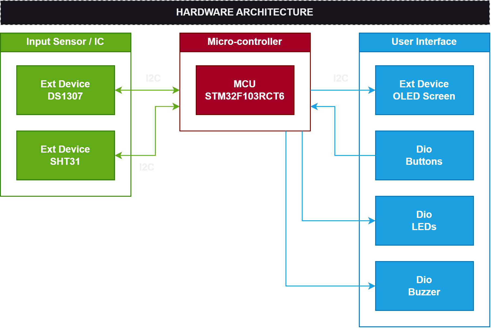
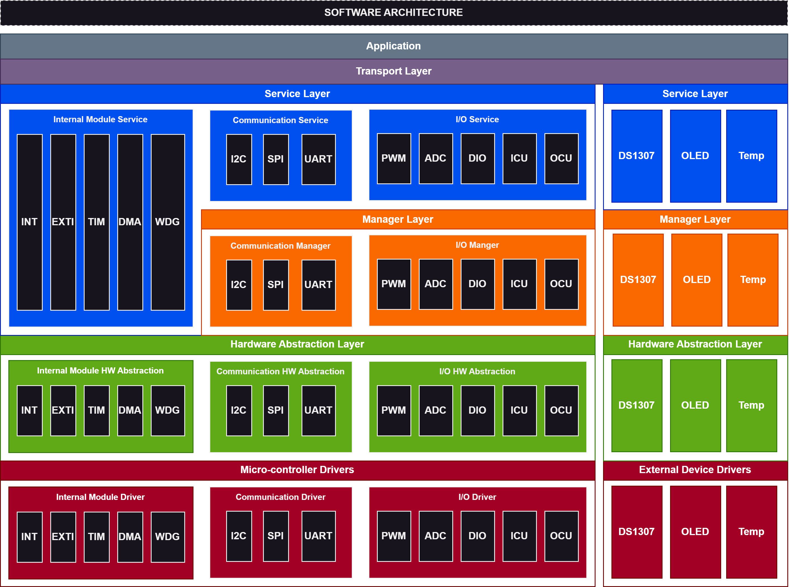

# STARK KIT BASE

## PURPOSE
Initial comment.

## FEATURES

The Stark Kit Base project includes the following features:

1. **Display information about Time, Temperature, Humidity**: The system will display the time (date, month, year, hours, minutes), temperature and humidity information on the OLED screen.

2. **Alarm**: The system can set time to alarm. It will notify by sound of buzzer and blink led.  

## DETAIL FEATURES
1. **Time, Temperature, Humidity Display**
   
| ID  | Functionality                  | Note                                                                 |
| --- | ------------------------------ | -------------------------------------------------------------------- |
| 01  | Display Current Time On OLED Screen | Display Year, Month, Day of Week, Day of Month, Hour, Minute |
| 02  | Display Temparature, Humidity            | Tempereture in Celsius, and Humidity on OLED Screen                                               |

## HARDWARE ARCHITECTURE
Stark Kit was assembled by these modules:
 Module         | Functionality                                    
 ---------------|----------------------------------- 
 STM32F103RCT6  | Main micro-controller              
 DS1307         | Real-time clock module             
 SSD1306        | Oled display module           
 SHT31          | Temperature and humidity sensor  
 MPU6050        | Gyroscope Accelerometer sensor
 BUTTON         |                  
 BUZZER         |      
 RGB LED        | 

## SOFTWARE ARCHITECTURE

## TOOLS
 | Name           | Version | Functionality                                      
 -----------------|---------|---------------------------------------
 | STM32CubeIDE   | 1.13.2  | Code editor, build and debugging tool              
 | STM32CubeMX    | 6.10.0  | Code generator
 | Logic Analyzer | 2.4.14  | Debugging and testing pulse signal
 | Draw.io        | 22.1.16 | Draw block diagram and flowchart
 | PlantUML       | 2.18.1  | Draw sequence diagram
 
## DEVELOPER TEAM
1. **Khoa Nguyen Minh**
