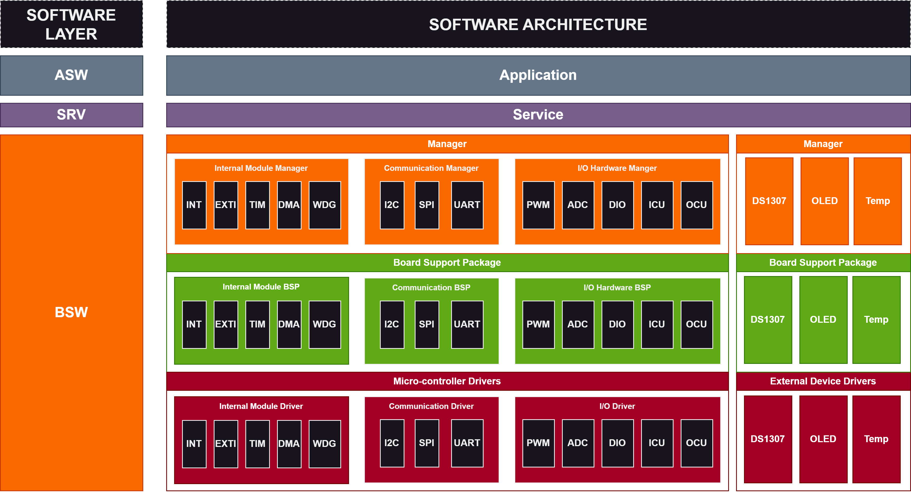

# Stark Kit Base

## Purpose
Initial comment.

## Features

The Stark Kit Base project includes the following features:

1. **Display information about Time, Temperature, Humidity**: The system will display the time (date, month, year, hours, minutes), temperature and humidity information on the OLED screen.

2. **Alarm**: The system can set time to alarm. It will notify by sound of buzzer and blink led.  

## Hardware design

 Module         | Functionality                                    
 ---------------|----------------------------------- 
 STM32F103RCT6  | Main micro-controller              
 DS1307         | Real-time clock module             
 SSD1306        | Oled display module           
 SHT31          | Temperature and humidity sensor  
 MPU6050        | Gyroscope Accelerometer sensor
 BUTTON         |                  
 BUZZER         |      
 RGB LED        | 

## Detailed Features
1. **Time, Temperature, Humidity Display**
   
| ID  | Functionality                  | Note                                                                 |
| --- | ------------------------------ | -------------------------------------------------------------------- |
| 01  | Display Current Time On OLED Screen | Display Year, Month, Day of Week, Day of Month, Hour, Minute |
| 02  | Display Temparature, Humidity            | Tempereture in Celsius, and Humidity on OLED Screen                                               |

## Software Architecture

## Developer Team
1. **Nguyen Minh Khoa**
